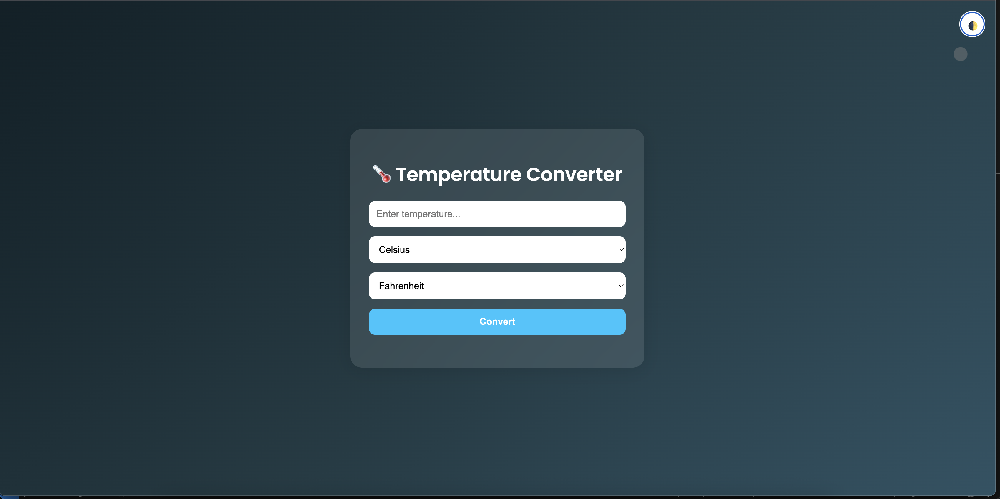

# OIBSIP_WebDevelopment_Task3
# 🌡️ Temperature Converter

A sleek and modern temperature converter web app that allows users to convert values between Celsius, Fahrenheit, and Kelvin with a beautiful glassmorphic UI, animated ghost cursor, and light/dark mode support.

---

## 🔥 Features

- ✅ Convert between **Celsius**, **Fahrenheit**, and **Kelvin**
- 🌙 **Toggle between light and dark mode**
- 🧠 **Conversion history** with real-time logging
- 👻 **Animated ghost cursor** effect for visual appeal
- 🎨 **Responsive glassmorphic design** with smooth transitions
- ⚡ Instant conversion with elegant animations

---

## 🛠️ Technologies Used

- **HTML5**
- **CSS3** (Glassmorphism, Transitions, Animations)
- **JavaScript (Vanilla)**

---

## 🚀 Live Demo

Check out the live version of the project here: [Live Demo](https://madgaurav.github.io/OIBSIP_WebDevelopment_Task3/)
---

## 📷 Screenshots

>  
> Example:
> 

---

